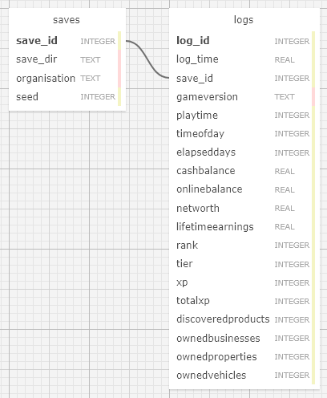

# --== [ H Y L A N D B O O K ]==--

HYLANDBOOK watches your [Schedule I](https://scheduleonegame.com) save files and logs progress to a local [SQLite](https://sqlite.org) database.  
Works with multiple save games automatically - you don't need to manage separate data files yourself - just switch between saves in-game.

It can also automatically create or update a JSON or plain text export whenever it detects changes in your save data - handy for showing live stats in [OBS Studio](https://obsproject.com), for example.

All save files are accessed read-only - nothing is ever modified.

Currently the following values from your save data are logged:

- save data directory name
- organisation name
- game seed
- game version
- playtime
- time of day
- elapsed days
- online balance
- networth
- lifetime earnings
- rank
- tier
- xp
- total xp
- discovered products (count)
- owned vehicles (count)


## Requirements

I last tested this on game version `0.4.0f5`.

- **Schedule I** save game folder
- **Windows OS (64-bit)** to use the [pre-built executable](./dist)

additionally...

**Users**:  
None if you use the pre-built `hylandbook.exe` file.  
If you want to run it directly from the [source](./hylandbook), [Python 3](https://python.org) is needed.  
To run it from the source: `python3 -m hylandbook`

**Developers**:  
To install the development dependencies, run [install_pyreq.cmd](./install_pyreq.cmd).  
To build the executable, run [bakedist.cmd](./bakedist.cmd).


## Installation + Usage

### 1. Download the program

Go to the [latest release page](https://github.com/etrusci-org/hylandbook/releases/latest) and download `hylandbook.exe`.

### 2. Put it somewhere easy to find

Save it in a folder like `Documents` or `Downloads`.  
**!** Don't put it in `Program Files` or other system folders - those need special permissions.  
For the examples, below, we assume you've saved it to your `Downloads` folder.

### 3. Open a command window

Press **Windows + R**, type `cmd`, and press **Enter**.

### 4. Go to the folder where you saved it

In the command window, type:

```batch
cd "C:\path\to\Downloads"
```

Replace the path with the folder where you saved the program.  
**!** If you saved it on a different drive (like `D:` or `E:`), type the drive letter first and press **Enter** before using `cd`. For example:

```batch
E:
cd "E:\path\to\Downloads"
```

### 5. Run the program

Type this and press **Enter**:

```batch
hylandbook.exe "C:\path to\Schedule I\SaveGame"
```

Replace the path with the location of your actual SaveGame folder.  
Usually you should find your save game folder in:  
`C:\Users\<YourName>\AppData\LocalLow\TVGS\Schedule I\Saves\<YourSteamID>`

### 6. Stop it

To stop the program at any time, press **CTRL + C** in the command window or just close the window.

### 7. See all options

To view everything the program can do run it without any arguments or the `--help` option.

```batch
hylandbook.exe
```
or
```batch
hylandbook.exe --help
```


## Even easier, run it with a shortcut

To make things easier, I've included a ready-made script file. This lets you run the program with a double-click, without typing commands.
You can find it alongside the [release files](https://github.com/etrusci-org/hylandbook/releases/latest) or [there](./dist/run_hylandbook.cmd).

### 1. Save the script

Save the file `run_hylandook.cmd` in the same folder as `hylandbook.exe`.

### 2. Edit the save game path

Right-click `run_hylandook.cmd` and choose **Edit** (this will open it in Notepad).

You'll see a line like this:  
```batch
"PATH_TO_SAVEGAME_FOLDER_HERE"
```
Replace `PATH_TO_SAVEGAME_FOLDER_HERE` with the actual path to your save game folder.  
Then save and close the file. For example:

Before:

```batch
.\hylandbook.exe ^
    "PATH_TO_SAVEGAME_FOLDER_HERE" ^
    -e txt ^
    -k organisation networth lifetimeearnings discoveredproducts ownedvehicles rank tier elapseddays
```

After:

```batch
.\hylandbook.exe ^
    "C:\Users\Alice\AppData\LocalLow\TVGS\Schedule I\Saves\12345678909876543\SaveGame_1" ^
    -e txt ^
    -k organisation networth lifetimeearnings discoveredproducts ownedvehicles rank tier elapseddays
```

### 3. Run it

Now you can just double-click `run_hylandbook.cmd` and it will launch `hylandbook.exe` with the save game path you've edited in.
Additionally it will export/update a text file containing some stats whenever save data changes are detected.

You can also right-click `run_hylandbook.cmd` and choose **Create shortcut**, then move the created shortcut to your **Desktop**.  
This way you can launch it directly from the Desktop.


## Where data is saved

By default HYLANDBOOK creates a folder called `hb_data` in the folder where you run `hylandbook.exe` (this is the "current working directory").

If you prefer the data to go somewhere else, use the `-d` option to set a different folder:

```batch
hylandbook.exe "C:\path to\Schedule I\SaveGame" -d "C:\path to\your hylandbook data folder"
```


## Options

You can use the short or long form of each option. E.g. `-i` and `--check-interval` are the same.

`-i, --check-interval SECONDS`  
How frequently to check the save data for changes, in seconds.  
Default: 60  
Minimum: 10

`-e, --export-types [TYPES ...]`  
Types of additional export files to create each time save data changes are detected.  
Default: no export  
Choices: `json` `txt`

`-k, --export-keys [KEYS ...]`  
Value keys of data to export.  
Default: all  
Choices: `_t` `save_dir` `organisation` `seed` `save_id` `gameversion` `playtime` `timeofday` `elapseddays` `onlinebalance` `networth` `lifetimeearnings` `rank` `tier` `xp` `totalxp` `discoveredproducts` `ownedvehicles`

`-d, --data-dir PATH`  
Path to folder where HYLANDBOOK will save data. Will be created automatically if it does not exist yet.  
Default: `<current working directory>\hb_data`


## Database schema



```sqlite
CREATE TABLE 'saves' (
    'save_id' INTEGER NOT NULL,

    'save_dir' TEXT NOT NULL,
    'organisation' TEXT NOT NULL,
    'seed' INTEGER NOT NULL,

    PRIMARY KEY('save_id' AUTOINCREMENT)
);

CREATE TABLE 'logs' (
    'log_id' INTEGER NOT NULL,

    'log_time' REAL NOT NULL,
    'save_id' INTEGER NOT NULL,

    'gameversion' TEXT DEFAULT NULL,
    'playtime' INTEGER DEFAULT NULL,
    'timeofday' INTEGER DEFAULT NULL,
    'elapseddays' INTEGER DEFAULT NULL,
    'onlinebalance' REAL DEFAULT NULL,
    'networth' REAL DEFAULT NULL,
    'lifetimeearnings' REAL DEFAULT NULL,
    'rank' INTEGER DEFAULT NULL,
    'tier' INTEGER DEFAULT NULL,
    'xp' INTEGER DEFAULT NULL,
    'totalxp' INTEGER DEFAULT NULL,
    'discoveredproducts' INTEGER DEFAULT NULL,
    'ownedvehicles' INTEGER DEFAULT NULL,

    PRIMARY KEY('log_id' AUTOINCREMENT),
    FOREIGN KEY ('save_id') REFERENCES 'saves'('save_id')
);
```


## License

HYLANDBOOK is licensed under [The MIT License](./LICENSE.md).
