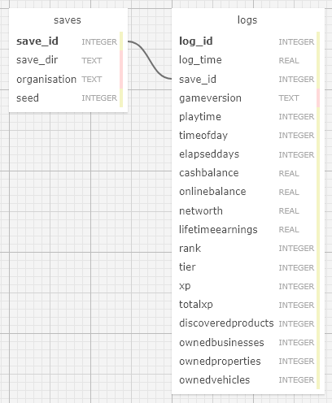

# HYLANDBOOK

HYLANDBOOK watches your [Schedule I](https://scheduleonegame.com) save data files and logs progress to a local [SQLite](https://sqlite.org) database.  
It can also automatically create/update export files with the *current* and *history* data - nifty for showing live stats in [OBS Studio](https://obsproject.com), for example.  
All save data files are accessed read-only - nothing is ever modified.  

Currently the following values from your save data are logged:
- save data directory name
- organisation name
- game seed
- game version
- playtime
- time of day
- elapsed days
- cashbalance
- online balance
- networth
- lifetime earnings
- level rank
- level tier
- level xp
- total xp over all levels
- discovered products (count)
- ownedbusinesses (count)
- ownedproperties (count)
- owned vehicles (count)


## Requirements

Last tested on game version `0.4.0f5`.

- **Schedule I** save game folder
- **Windows OS (64-bit)** to use the [pre-built executable](./dist)

optionally...

**Users**:  
If you want to run it directly from the [source code](./hylandbook), [Python 3](https://python.org) is needed.  
To run it from the source code: `python3 -m hylandbook`

**Developers**:  
To install the development dependencies, run [install_pyreq.cmd](./install_pyreq.cmd).  
To build the executable, run [bakedist.cmd](./bakedist.cmd).


## Installation

**1. Download the pre-built executable**:  
Go to the [latest release page](https://github.com/etrusci-org/hylandbook/releases/latest) and download `hylandbook.exe`.

**2. Put it somewhere easy to find**:  
Save it in a folder like `Documents` or `Downloads`.  
**!** Don't put it in `Program Files` or other system folders - those need special permissions.  
For the examples below, we assume you've saved it to your `Downloads` folder.


## Run it the easy way

To make things easier, I've included a ready-made script file. This lets you run HYLANDBOOK with a double-click, without typing commands.
You can find it alongside the [release files](https://github.com/etrusci-org/hylandbook/releases/latest) or [there](./dist/run_hylandbook.cmd).

**1. Save the script**:  
Save the file `run_hylandook.cmd` in the same folder as `hylandbook.exe`.

**2. Edit the save game path**:  
Right-click `run_hylandook.cmd` and choose **Edit** (this will open it in Notepad).

You'll see a line like this:  
```txt
"PATH_TO_SAVEGAME_FOLDER_HERE"
```
Replace `PATH_TO_SAVEGAME_FOLDER_HERE` with the actual path to your save game folder.  
Then save and close the file. For example:

Before:

```txt
.\hylandbook.exe ^
    "PATH_TO_SAVEGAME_FOLDER_HERE" ^
    --export-current txt ^
    --export-keys organisation networth lifetimeearnings rank elapseddays
```

After:

```txt
.\hylandbook.exe ^
    "C:\Users\Alice\AppData\LocalLow\TVGS\Schedule I\Saves\12345678909876543\SaveGame_1" ^
    --export-current txt ^
    --export-keys organisation networth lifetimeearnings rank elapseddays
```

**3. Run it**:  
Now you can just double-click `run_hylandbook.cmd` and it will launch `hylandbook.exe` with the save game path you've edited in.
Additionally it will export/update a text file containing some stats whenever save data changes are detected.  
You can right-click `run_hylandbook.cmd` and choose **Create shortcut**, then move the created shortcut to your **Desktop**.  
This way you can launch it directly from the Desktop.


## Run it the manual way

**1. Open a command window**:  
Press **Windows + R**, type `cmd`, and press **Enter**.

**2. Go to the folder where you saved it**:  
In the command window, type:

```txt
cd "C:\path\to\Downloads"
```

Replace the path with the folder where you saved `hylandbook.exe`.  
**!** If you saved it on a different drive (like `D:` or `E:`), type the drive letter first and press **Enter** before using `cd`. For example:

```txt
E:
cd "E:\path\to\Downloads"
```

**3. Run it**:  
Type this and press **Enter**:

```txt
hylandbook.exe "C:\path to\Schedule I\SaveGame"
```

Replace the path with the location of your actual SaveGame folder.  
Usually you should find your save game folder in:  
`C:\Users\<YourName>\AppData\LocalLow\TVGS\Schedule I\Saves\<YourSteamID>`

**4. Stop it**:  
To stop at any time, press **CTRL + C** in the command window or just close the window.

**5. See all options**:  
To view all options and their help text run it with the `--help` option.

```txt
hylandbook.exe --help
```


## Where data is saved

By default HYLANDBOOK creates a folder called `hb_data` in the folder from where you run `hylandbook.exe` (this is the "current working directory").

If you prefer the data to go somewhere else, use the `--data-dir` option to set a different folder:

```txt
hylandbook.exe "C:\path to\Schedule I\SaveGame" --data-dir "C:\path to\your hylandbook data folder"
```


## Command-line usage / options

```txt
hylandbook.exe SAVEGAME_PATH [options]
```

**Required**:

`SAVEGAME_PATH`  
Path to a Schedule I `SaveGame_*` directory, enclose it in quotes if it contains spaces, e.g. `"C:\path to\SaveGame_1"`.  

**Options**:

All options are optional and will use their defaults if not set by you.

`-i, --check-interval SECONDS`  
How frequently to check the save data for changes, in seconds.  
Default: `60`  
Minimum: `10`  
Example: `-i 120`

`-c, --export-current [TYPE ...]`  
One or more types of *current* export files to update each time save data changes are detected.  
Default: *no export*  
Choices: `json` `txt`  
Example: `-c json txt`

`-y, --export-history [TYPE ...]`  
One or more types of *history* export files to update each time save data changes are detected.  
Default: *no export*  
Choices: `json` `csv`  
Example: `-y json csv`

`-m, --history-limit NUMBER`  
Limit the number of recent rows that are exported in *history* export files.  
Default: *no limit*  
Minimum: `1`  
Example: `-m 25`

`-k, --export-keys [KEY ...]`  
Value keys of data to export. Does currently not apply to *history* exports.  
Default: *export all data*  
Choices: `_t` `save_dir` `organisation` `seed` `save_id` `gameversion` `playtime` `timeofday` `elapseddays` `cashbalance` `onlinebalance` `networth` `lifetimeearnings` `rank` `tier` `xp` `totalxp` `discoveredproducts` `ownedbusinesses` `ownedproperties` `ownedvehicles`  
Example: `-k organisation rank tier networth`

`-d, --data-dir PATH`  
Path to folder where HYLANDBOOK will save data. Will be created automatically if it does not exist yet.  
Default: `<current working directory>\hb_data`  
Example: `-d "C:\path to\another data folder"`

`-h, --help`  
Show this help.  
Example: `-h`


## Database schema



```sqlite
CREATE TABLE 'saves' (
    'save_id' INTEGER NOT NULL,
    'save_dir' TEXT NOT NULL,
    'organisation' TEXT NOT NULL,
    'seed' INTEGER NOT NULL,
    PRIMARY KEY('save_id' AUTOINCREMENT)
);

CREATE TABLE 'logs' (
    'log_id' INTEGER NOT NULL,
    'log_time' REAL NOT NULL,
    'save_id' INTEGER NOT NULL,
    'gameversion' TEXT DEFAULT NULL,
    'playtime' INTEGER DEFAULT NULL,
    'timeofday' INTEGER DEFAULT NULL,
    'elapseddays' INTEGER DEFAULT NULL,
    'cashbalance' REAL DEFAULT NULL,
    'onlinebalance' REAL DEFAULT NULL,
    'networth' REAL DEFAULT NULL,
    'lifetimeearnings' REAL DEFAULT NULL,
    'rank' INTEGER DEFAULT NULL,
    'tier' INTEGER DEFAULT NULL,
    'xp' INTEGER DEFAULT NULL,
    'totalxp' INTEGER DEFAULT NULL,
    'discoveredproducts' INTEGER DEFAULT NULL,
    'ownedbusinesses' INTEGER DEFAULT NULL,
    'ownedproperties' INTEGER DEFAULT NULL,
    'ownedvehicles' INTEGER DEFAULT NULL,
    PRIMARY KEY('log_id' AUTOINCREMENT),
    FOREIGN KEY ('save_id') REFERENCES 'saves'('save_id')
);
```


## License

HYLANDBOOK is licensed under [The MIT License](./LICENSE.md).
